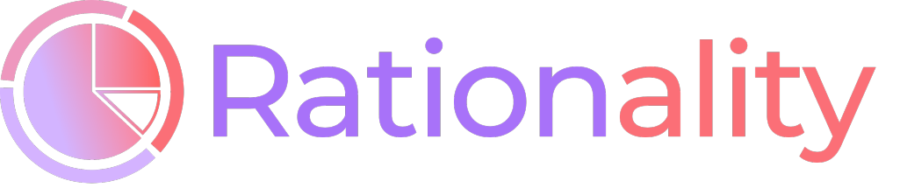

11% of people around the world suffer from chronic hunger and undernourishment. In this same world, it is estimated that 1.3 billion tonnes of food, about one third of the world's food supply, is wasted each year. The effects of food wastage include the loss of biodiversity, an increased blue water footprint, an increased carbon footprint, the acceleration of climate change, and needless starvation, the vast majority of which is experienced by those in developing countries.
 
One of the main causes of food waste is a consumer’s lack of planning. Often, people will make trips to the grocery store and buy a large amount of food without thinking about how and when the food will be prepared and eaten. Due to poor planning, some of the food will inevitably go bad before the consumer gets the chance to use it, and thus into the garbage it goes.

Rationality aims toward reducing the large amounts of food waste - that often end up in landfills and combustion facilities - with the help of an app that allows the user to plan out what meals they would like to have in the course of week. The user selects recipes and assigns them to a date in the calendar. Then, a shopping list is generated with all the ingredients needed to prepare the meals- no more, no less. The user can also input ingredients they already have in the inventory page. That way, an ingredient is only added to the shopping list if it is not already in the inventory. Once an item is checked off of the shopping list, it is automatically added to the inventory. Rationality also offers a recipe page where the user can explore new foods and get a better idea of what they would like to eat. If the user finds a recipe they love, they can add it to their favorites for easy access.
